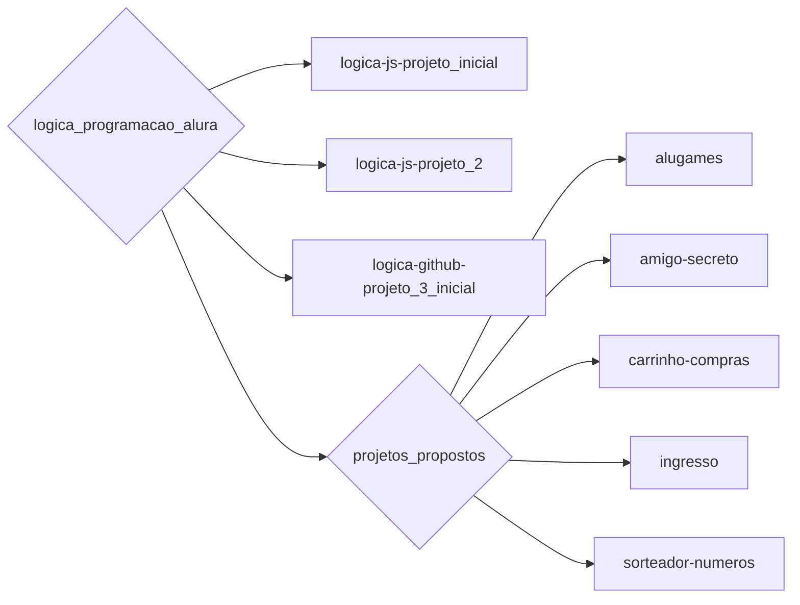

<h1>Logica de programacao ALURA</h1>

<h2>Sobre</h2>

Projeto utilizado nos cursos de lógica de programação da Alura.

## Estrutura do projeto

```mermaid
graph LR
A{logica_programacao_alura} --> B[logica-js-projeto_inicial]
A --> C[logica-js-projeto_2]
A --> D[logica-github-projeto_3_inicial]
A --> E{projetos_propostos}
E --> a[alugames]
E --> b[amigo-secreto]
E --> c[carrinho-compras]
E --> d[ingresso]
E --> e[sorteador-numeros]
```

## Tecnologias

  
  
  

